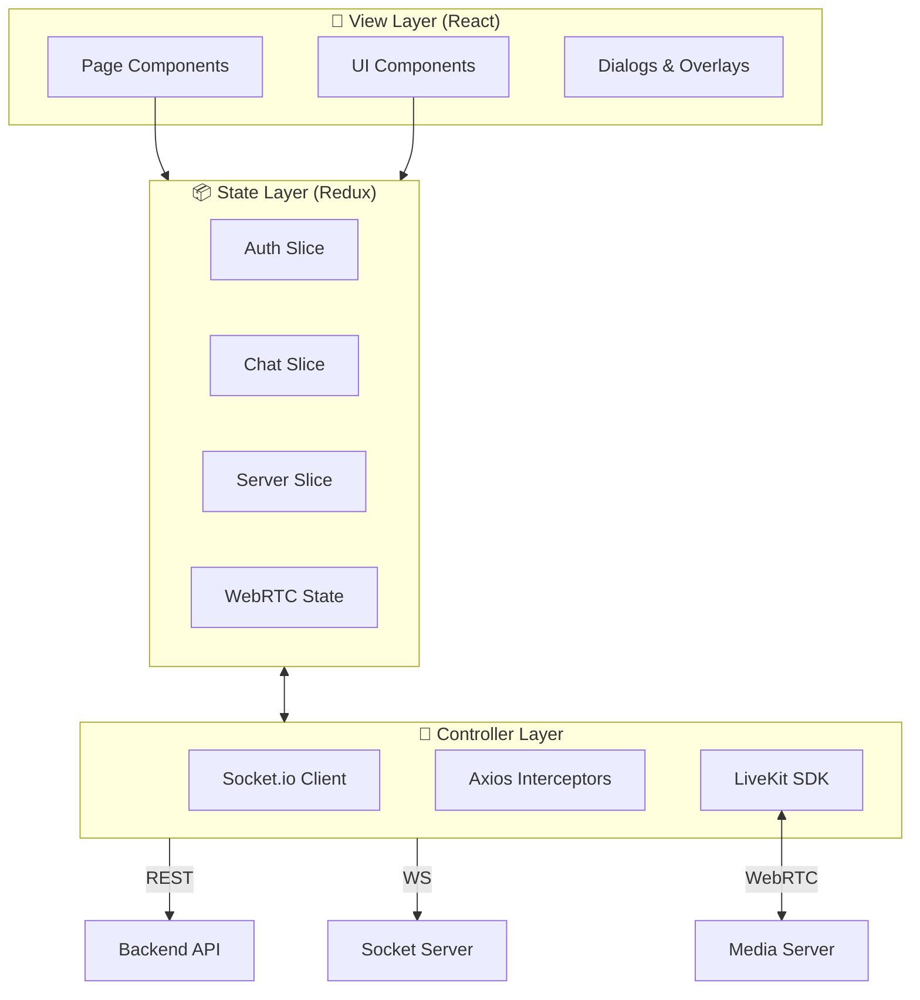

# 💻 Discord Clone - Frontend Client


> A highly interactive, responsive, and real-time Discord client built with React.

---

## 🛠️ Complete Tech Stack

| Category | Technologies |
| :--- | :--- |
| **Framework** | React 19, Vite 7, TypeScript |
| **State Management** | Redux Toolkit (RTK), React-Redux |
| **Styling** | TailwindCSS v4, Class Variance Authority (CVA), Tailwind Merge |
| **UI Components** | Radix UI Primitives (Dialog, Popover, Tooltip, etc.), Lucide React (Icons) |
| **Animations** | Framer Motion, GSAP, Tailwind Animate |
| **Real-time** | Socket.io-client, LiveKit Client (WebRTC) |
| **Forms & Validation** | React Hook Form, Zod |
| **Utils** | Date-fns, Input-OTP, Sonner (Toasts) |

---

## 🌟 Client Features & UX

### 🎨 Modern UI/UX
-   **Responsive Design**: Fully adaptive layouts for Desktop and Tablet.
-   **Dark Mode**: Native dark theme support using `next-themes`.
-   **Smooth Animations**: Entrance animations and micro-interactions powered by Framer Motion.
-   **Accessible**: Built on Radix UI primitives for WAI-ARIA compliance.

### 💬 Chat Experience
-   **Optimistic UI**: Instant message rendering before server confirmation.
-   **Infinite Scroll**: Seamless loading of chat history using Intersection Observer.
-   **Rich Input**: Emoji picker, file attachments (Drag & Drop), and formatting support.
-   **Real-time Typing**: "User is typing..." indicators synced via Socket.io.

### 📹 Media & Calls
-   **Video/Voice Channels**: One-click join/leave for voice rooms.
-   **Control Bar**: Mute, Deafen, Camera, and Screen Share toggles.
-   **Grid Layout**: Auto-adjusting video grid for participants.

### 🧩 Component Architecture
-   **Atomic Design**: Components split into `ui` (primitive) and feature-based folders.
-   **Modals Provider**: Centralized modal management for "Create Server", "Invite", "Edit Profile".

## 🖼️ UI Showcase

| Light Mode | Dark Mode |
| :---: | :---: |
|  |  |

> *Screenshots coming soon...*


### Client Architecture



---

## 🛠️ Setup & Development

### 1. Prerequisites
- Node.js v18+
- Backend server running (for API calls)

### 2. Installation
```bash
# Navigate to frontend
cd Discord-FE

# Install dependencies
npm install
# or
yarn install
```

### 3. Configuration
Create a `.env` file in the root directory:

```env
VITE_API_URL="http://localhost:3000/api/v1"
VITE_SOCKET_URL="http://localhost:3000"
VITE_LIVEKIT_URL="..."
VITE_CLOUDINARY_CLOUD_NAME="..."
```

### 4. Running the Client
```bash
# Development Mode (Vite server)
npm run dev
# App will run at http://localhost:5173

# Production Build
npm run build
npm run preview
```

---

## 📦 State Management (Redux)

The application uses **Redux Toolkit** for centralized state.

- `authSlice`: User session, JWT token, User profile.
- `chatSlice`: Current channel, messages, typing status.
- `serverSlice`: List of joined servers, current server details.
- `friendSlice`: Pending requests, friend list, online status.
- `mediaChannelSlice`: Active voice/video call state.

---

## 📂 Project Structure

- `src/components`: Reusable UI components (Buttons, Inputs, Chat Bubbles).
- `src/pages`: Top-level route components (Dashboard, Login).
- `src/store`: Redux slices and configuration.
- `src/services`: API service functions (axios instances).
- `src/hooks`: Custom React hooks (useSocket, useAuth).
- `src/utils`: Helper functions and constants.
